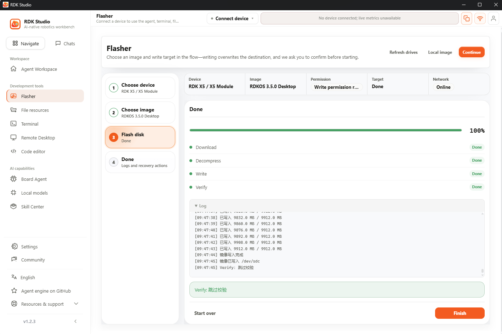
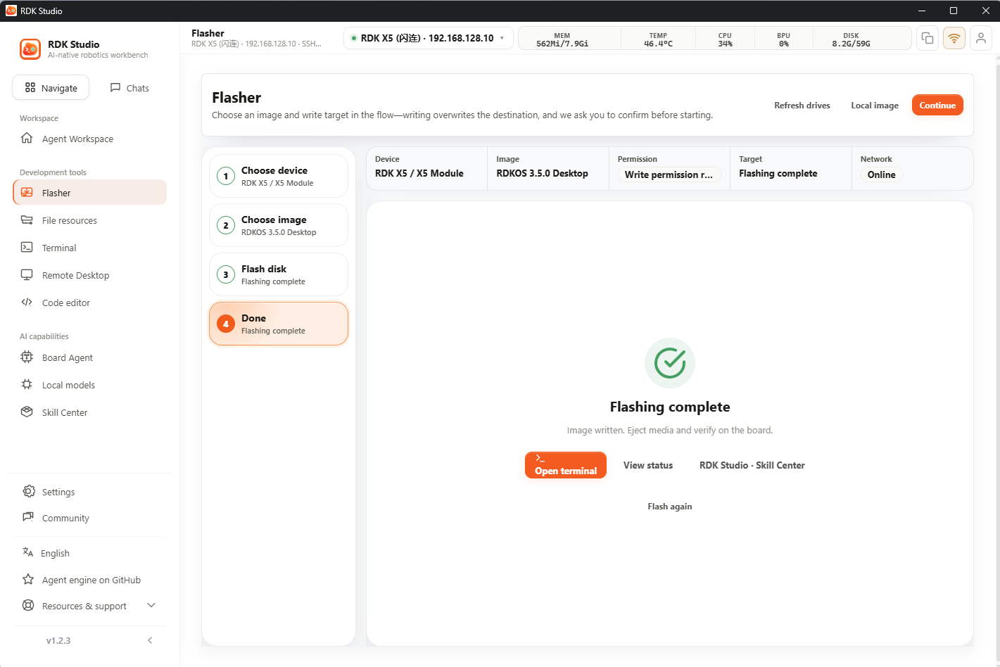
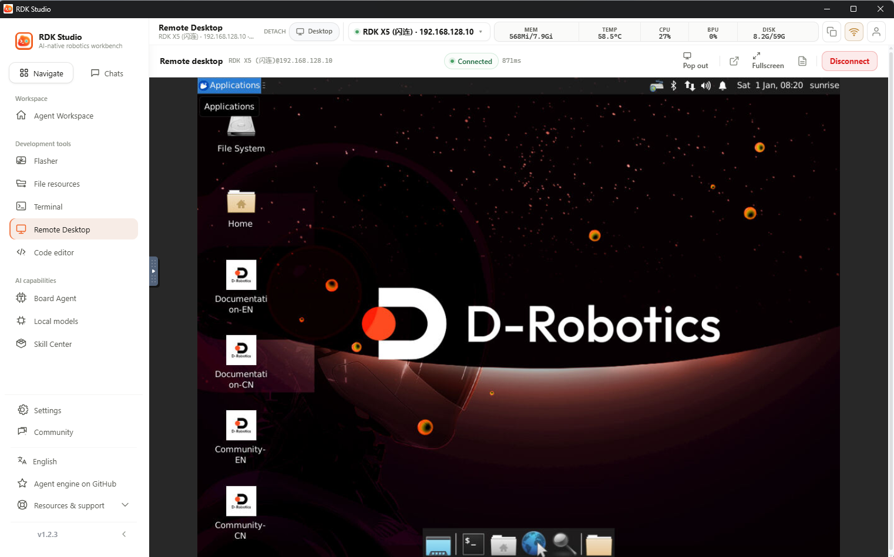
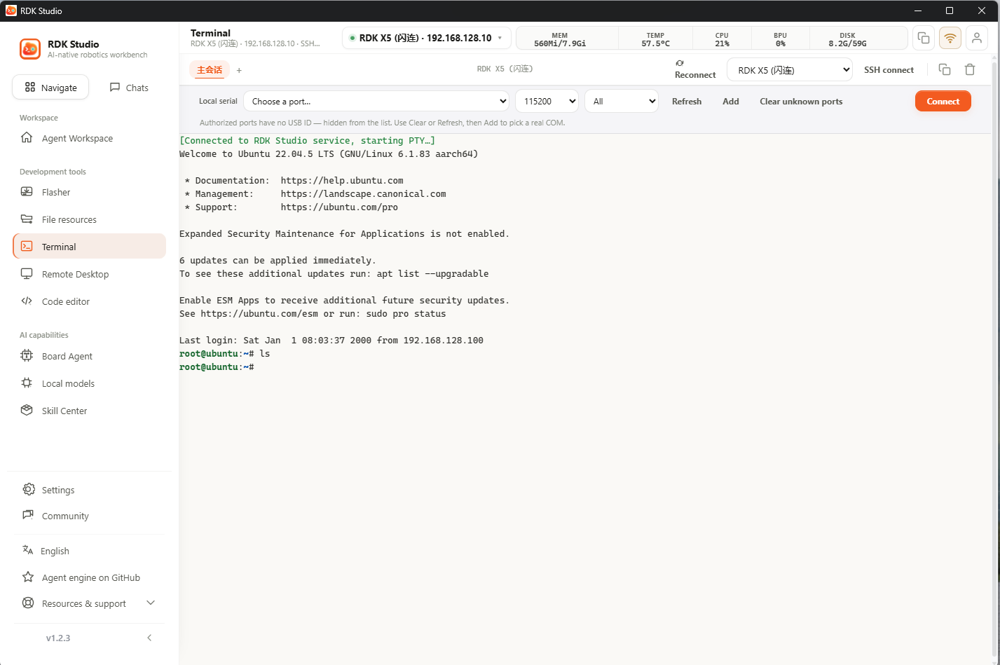
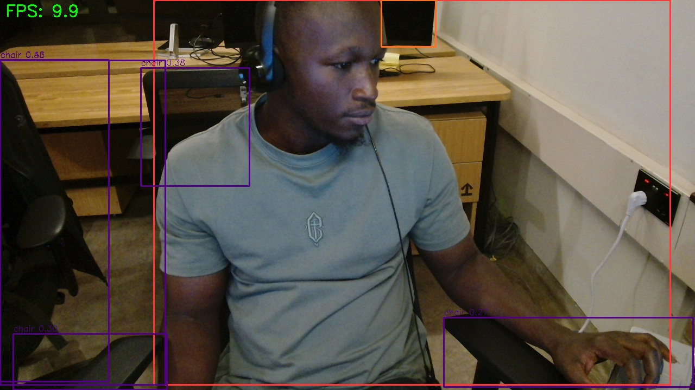
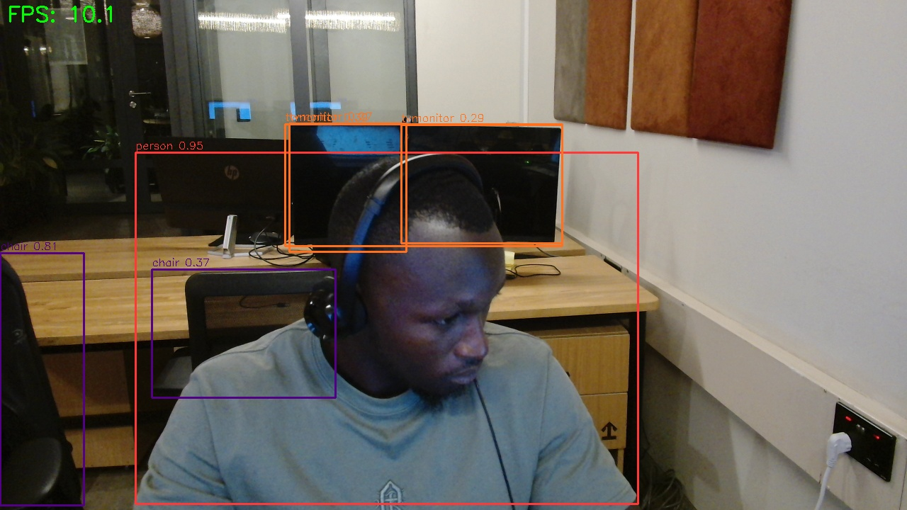

# Challenge 1 — Board Bring-Up ("Wake the board")

**Device:** RDK X5 / X5 Module
**Tool used:** RDK Studio v1.2.3
**OS image:** RDKOS 3.5.0 Desktop (Ubuntu 22.04.5 LTS, kernel 6.1.83 aarch64)
**Board IP:** 192.168.128.10 (connection profile "RDK X5 (闪连)")

---

## 1. System image flash ✅ Complete

Flashed using RDK Studio's **Flasher** tool:

- Device: `RDK X5 / X5 Module`
- Image: `RDKOS 3.5.0 Desktop`
- Steps Download → Decompress → Write → Verify all reported **Done**, write reached 9912.0 MB / 9912.0 MB (100%).



> Note: the log line reads `Verify: 跳过校验` ("verification skipped"), so the checksum/verify pass itself was bypassed by the tool rather than confirmed — worth knowing if a reviewer asks specifically about verified writes.

The flasher then reported the flash as finished:



**Boot evidence:** Remote Desktop session into the board shows it booted past flashing into a working desktop environment (D-Robotics splash/desktop, application launcher visible), confirming a successful boot:




---

## 2. SSH login ✅ complete

Opened an interactive SSH shell from the PC to the board via RDK Studio's Terminal panel. Welcome banner confirms `Ubuntu 22.04.5 LTS (GNU/Linux 6.1.83 aarch64)`, and a command (`ls`) was run successfully at the `root@ubuntu:~#` prompt:



**Gap:** the challenge calls out `uname -a` and `htop` specifically as example commands. The screenshot only shows `ls`. Worth re-running and capturing `uname -a` (and optionally `htop`) for a screenshot that matches the wording exactly.

---

## Summary

| # | Task | Status | Evidence |
|---|------|--------|----------|
| 1 | System image flash | ✅ Complete | `01-flash-progress.png`, `02-flash-complete.png`, `05-desktop-boot.png` |
| 2 | SSH login | ✅ Shell access shown; exact example commands (`uname -a`, `htop`) not yet captured | `04-ssh-terminal.png` |

# Challenge 2 — Sensor Explorer

## RDK X5 Peripherals — Distance-Driven Servo + LEDs

This project reads distance from a **Benewake TF-Luna** (I2C mode) and uses it to
drive a **hobby servo** and **three LEDs** through staged thresholds.


Main script: [`distance_servo_led.py`](distance_servo_led.py)

Helper test scripts: [`tfluna_i2c.py`](tfluna_i2c.py) (sensor only),

[`servo_sweep.py`](servo_sweep.py) (servo only).

---

## What it does

The loop reads the TF-Luna ~10 times a second and picks one stage based on the
measured distance. Exactly one stage is active at a time (the servo can only hold
one angle), so only that stage's LED is lit:

| Distance (m)        | Servo angle | LED on        |
|---------------------|-------------|---------------|
| `d >= 1.5`          | 135°        | LED3 (pin 15) |
| `1.0 <= d < 1.5`    | 90°         | LED2 (pin 13) |
| `0.5 <= d < 1.0`    | 45°         | LED1 (pin 11) |
| `d < 0.5` / no read | 0°          | all off       |

> These thresholds live in the `STAGES` table near the top of
> `distance_servo_led.py` — edit that one place to retune the distances, angles,
> or LED mapping. A reading with signal strength below `MIN_AMP` (100) or
> distance `<= 0` is treated as "no reliable reading" and falls back to idle.

---

## Hardware wiring (40-pin header, BOARD numbering)

| Peripheral | Signal        | Header pin | Notes                                   |
|------------|---------------|-----------|------------------------------------------|
| TF-Luna    | VCC           | 2 or 4    | 5V                                       |
| TF-Luna    | SDA           | 3         | I2C5_SDA                                 |
| TF-Luna    | SCL           | 5         | I2C5_SCL                                 |
| TF-Luna    | GND           | 6         |                                          |
| TF-Luna    | config (pin 5)| GND       | tie low to select I2C mode               |
| Servo      | signal        | **18**    | pwm1 (34150000) ch1 — PWM-capable        |
| Servo      | V+            | 2 or 4    | 5V (see power note below)                |
| Servo      | GND           | 6 / 9 …   | must share GND with the board            |
| LED1       | anode         | 11        | GPIO17 → resistor (~330 Ω) → LED → GND   |
| LED2       | anode         | 13        | GPIO27 → resistor → LED → GND            |
| LED3       | anode         | 15        | GPIO22 → resistor → LED → GND            |

**LED orientation:** each GPIO pin → current-limiting resistor (~330 Ω) →
LED anode (long leg); LED cathode (short leg) → GND.

### Wiring diagram

```
        RDK X5 40-pin header (BOARD numbering, pin 1 top-left)
        odd pins = left column, even pins = right column

                          +-----+-----+
                     3V3  |  1  |  2  |  5V  ----+------------> Servo V+
        TF-Luna SDA <---  |  3  |  4  |  5V      +-----------> TF-Luna VCC
        TF-Luna SCL <---  |  5  |  6  |  GND ----+--+--------> TF-Luna GND
                   GPIO7  |  7  |  8  |  TXD     |  +--------> TF-Luna config (tie low)
                     GND  |  9  | 10  |  RXD     |
        LED1 +--[330R]--  | 11  | 12  |  GPIO    +-----------> Servo GND
        LED2 +--[330R]--  | 13  | 14  |  GND
        LED3 +--[330R]--  | 15  | 16  |  GPIO
                     3V3  | 17  | 18  |  <--- Servo signal (PWM)
                SPI_MOSI  | 19  | 20  |  GND
                  ...     | ..  | ..  |  ...
                          +-----+-----+

  LED detail (x3, one per pin 11 / 13 / 15):

      pin --->|---[330R]---+
            (GPIO)         |
                          GND        |>|  = LED, flat/short leg = cathode -> GND

  Servo (3-wire):
      signal (orange/white) ---> pin 18
      V+     (red)          ---> 5V  (pin 2 or 4)
      GND    (brown/black)  ---> GND (pin 6 or 9)   [common ground required]
```

**Servo power:** a small servo can run off the board's 5V for light loads, but
servos draw current spikes that can brown out the board. For anything beyond a
tiny servo, power it from a separate 5V supply and connect that supply's GND to
a board GND pin (common ground is required).

---

## Why servo signal is on pin 18 (not pin 33)

The X5 has four PWM controllers. On the default image, **pwm0/pwm1/pwm2 are
enabled** but **pwm3 (the controller behind header pins 32 and 33) is disabled**,
so pin 33 fails with:

```
FileNotFoundError: .../34170000.pwm/export
```

Pin **18** maps to `pwm1` (`34150000`, channel 1), which is enabled by default —
so it works with no config change and no reboot. Other already-live PWM pins:
29, 31, 37 (and 27, 28).

If you prefer to use pin 33, enable its controller with `sudo srpi-config`
(enable `pwm3`, which disables `i2c1` — harmless here since the TF-Luna is on
i2c5), then reboot. After reboot a new `pwmchip` for `34170000.pwm` appears
under `/sys/class/pwm/`.

---

## One-time setup

1. **Enable I2C5** for the 40-pin header (if not already):

   ```bash
   sudo srpi-config        # Interface/Peripheral config -> enable i2c5
   ```

2. **Install I2C tools and the Python deps:**

   ```bash
   sudo apt install -y i2c-tools
   pip3 install -r requirements.txt
   ```

   `Hobot.GPIO` ships with the RDK X5 system image (no pip install needed), so
   it is not in `requirements.txt`.

3. **Confirm the sensor is on the bus** — look for address `0x10`:

   ```bash
   sudo i2cdetect -y -r 5
   ```

---

## Bench-test each peripheral first

Test the sensor on its own:

```bash
python3 tfluna_i2c.py        # prints distance / amplitude / temperature
```

Test the servo on its own (sweeps 0°→180°→0°):

```bash
python3 servo_sweep.py --cycles 2
```

Both scripts default to the same pins as the combined script, so if they work
individually the combined run will too.

---

## Run the combined sequence

```bash
python3 distance_servo_led.py
```

Sample output:

```
Running distance -> servo + LED sequence. Ctrl-C to stop.
0.42 m               -> servo   0 deg, off
0.73 m               -> servo  45 deg, LED1
1.21 m               -> servo  90 deg, LED2
1.80 m               -> servo 135 deg, LED3
no reliable reading  -> servo   0 deg, off
```

Stop with **Ctrl-C** — the script calls `servo.stop()` and `GPIO.cleanup()` on
exit so the pins are released cleanly.

---

## Troubleshooting

| Symptom | Likely cause / fix |
|---|---|
| `FileNotFoundError: .../34170000.pwm/export` | Servo on pin 33; move signal to pin 18, or enable `pwm3` via `srpi-config`. |
| `I2C read failed` / nothing at `0x10` | Check I2C5 is enabled, wiring on pins 3/5, and the TF-Luna config pin is tied to GND. Re-run `i2cdetect -y -r 5`. |
| `no reliable reading` at close range | TF-Luna's reliable minimum is ~0.2 m; readings below that (or weak `amp`) are rejected. |
| Servo jitters or won't hold | Power the servo from a dedicated 5V supply with a shared ground. |
| LED never lights | Check resistor + LED orientation (anode to GPIO side), and that the pin is in `LED_PINS`. |
| Permission denied on PWM/GPIO sysfs | Run with the user that owns the gpio/pwm udev groups, or use `sudo`. |

# Challenge 3 — First AI Task
## YOLO11m Object Detection on RDK X5 (Live Webcam)

Real-time YOLO11m object detection running **on the RDK X5 BPU** (not on a PC),
with a USB webcam as the live input. Output is observable as both annotated
images and per-detection terminal labels.

- **Board:** RDK X5 (Sunrise/Hobot SoC, BPU Platform 1.3.6)
- **Camera:** Logitech HD Pro Webcam C920 on `/dev/video0`
- **Model:** `yolo11m_detect_bayese_640x640_nv12.bin` (20 MB, COCO 80-class)
- **Runtime:** `hbm_runtime` / HBRT 3.15.55, DNN runtime 1.24.5
- **Measured throughput:** ~10 FPS, single BPU core (`--bpu-cores 0`)

Reference implementation: the `ultralytics_yolo` sample in
[`rdk_model_zoo`](rdk_model_zoo/samples/vision/ultralytics_yolo). The run shown
below is the actual on-device execution.

---

## Detection results (my run)

Detecting `person`, `chair`, `tvmonitor`, `mouse`, `diningtable` from the live
C920 feed. The green `FPS` overlay is drawn each frame.





Corresponding terminal output (headless run, labels + confidences per frame):

```
[BPU_PLAT]BPU Platform Version(1.3.6)! soc info(x5)
[HBRT] set log level as 0. version = 3.15.55.0
[DNN] Runtime version = 1.24.5_(3.15.55 HBRT)
[A][DNN][packed_model.cpp:247][Model] [HorizonRT] The model builder version = 1.24.3
frame 0  FPS:   1.5  6 det  [person:0.93, chair:0.52, chair:0.40, chair:0.34, chair:0.31, diningtable:0.42]
frame 1  FPS:  14.7  7 det  [person:0.95, chair:0.65, chair:0.50, chair:0.33, chair:0.32, diningtable:0.35, tvmonitor:0.60]
frame 2  FPS:  12.3  6 det  [person:0.95, chair:0.83, chair:0.53, chair:0.46, chair:0.26, tvmonitor:0.53]
frame 5  FPS:  10.0  6 det  [person:0.95, chair:0.79, chair:0.48, chair:0.34, diningtable:0.26, tvmonitor:0.48]
frame 6  FPS:   9.8  7 det  [person:0.95, chair:0.84, chair:0.44, chair:0.36, chair:0.34, tvmonitor:0.42, mouse:0.29]
Saved annotated frame to /home/sunrise/yolo11m_webcam_proof.jpg
```

The first frame is slower (~1.5 FPS) because it includes model load and first
inference warm-up; subsequent frames settle at ~10 FPS.

---

## How to reproduce

### 1. Prerequisites (already present on this image)

| Component | Check |
|-----------|-------|
| Webcam | `v4l2-ctl --list-devices` → C920 at `/dev/video0` |
| BPU runtime | `python3 -c "import hbm_runtime"` |
| OpenCV | `python3 -c "import cv2; print(cv2.__version__)"` → 4.11.0 |
| Model file | `samples/vision/ultralytics_yolo/model/yolo11m_detect_bayese_640x640_nv12.bin` |
| COCO labels | `datasets/coco/coco_classes.names` |

If the model `.bin` is missing, fetch it from the sample's `model/` directory:

```bash
cd rdk_model_zoo/samples/vision/ultralytics_yolo/model
bash download_model.sh
```

### 2. Run it

```bash
cd rdk_model_zoo/samples/vision/ultralytics_yolo/runtime/python
```

**Headless** (no monitor) — prints labels and saves an annotated frame. This is
the run captured above:

```bash
python3 webcam_detect.py --no-display --max-frames 10 \
    --save ~/yolo11m_webcam_proof.jpg
```

**Live window** (monitor / VNC attached) — press `q` to quit:

```bash
python3 webcam_detect.py --camera 0
```

### 3. Useful options

| Flag | Default | Purpose |
|------|---------|---------|
| `--camera` | `0` | `/dev/video` index |
| `--width` / `--height` | `1280` / `720` | capture resolution |
| `--score-thres` | `0.25` | min confidence to keep a detection |
| `--nms-thres` | `0.70` | NMS IoU threshold |
| `--bpu-cores` | `0` | BPU core(s) to schedule on |
| `--no-display` | off | headless mode (print labels, no window) |
| `--max-frames` | `0` | stop after N frames (`0` = run until quit) |
| `--save PATH` | — | write the last annotated frame to PATH |

---

## Notes

- `--no-display`, `--max-frames`, and `--save` were added to the stock
  `webcam_detect.py` so it can run on a headless board and leave a verifiable
  artifact (annotated image + terminal labels).
- The model is NV12 / 640×640 input; the `UltralyticsYOLODetect` wrapper in
  `ultralytics_yolo_det.py` handles letterbox pre-processing and decode/NMS
  post-processing, so live webcam frames and single-image runs use identical
  logic.
- Confirm the model runs on the **BPU** (not CPU): the `[BPU_PLAT] ... soc
  info(x5)` and `[DNN] Runtime version` banner at startup is the proof.
